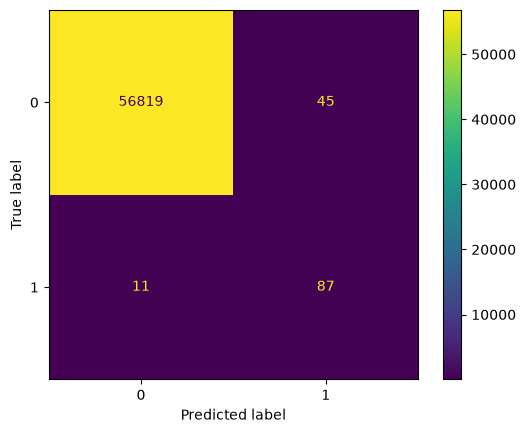
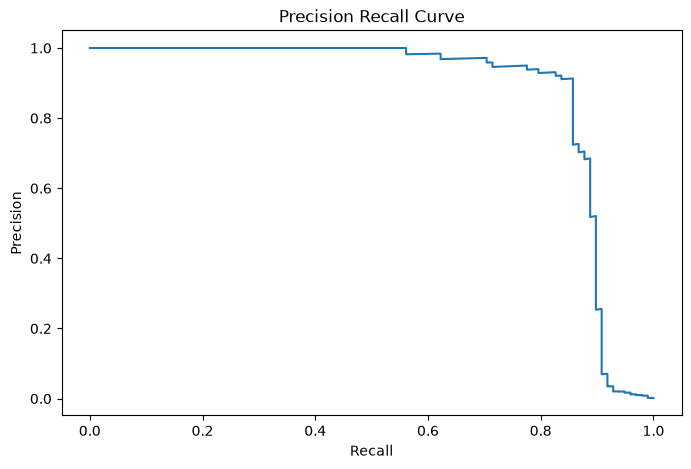
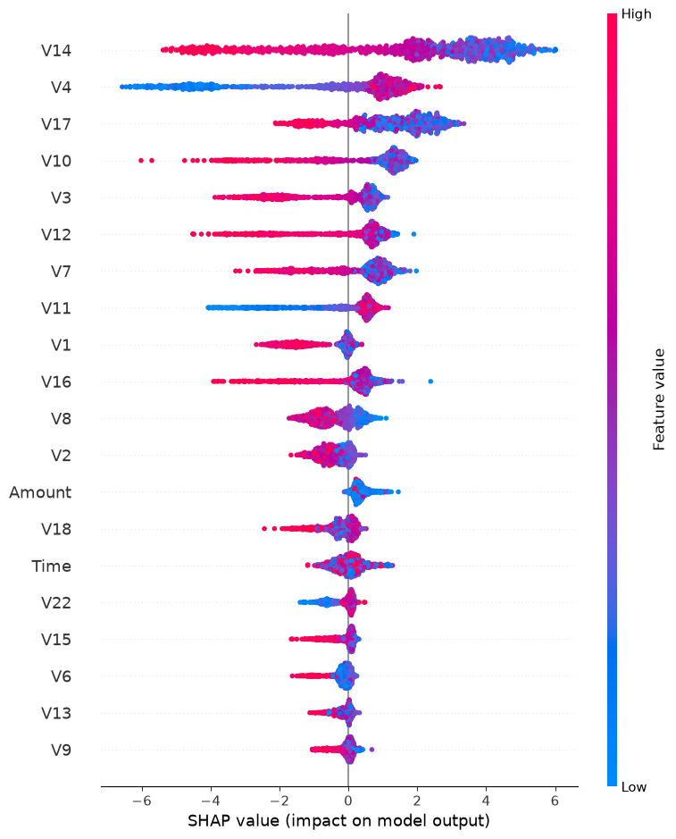

# 💳 Fraud Detection System


An end-to-end Machine Learning system for detecting fraudulent credit card transactions using **XGBoost**, **SMOTE**, **FastAPI**, **MLflow**, **SHAP Explainability**, **Docker**, and **Render Cloud Deployment**.

---

# 🌐 Live Deployment

### 🚀 Live API

https://fraud-detection-system-63kg.onrender.com

### 📖 Swagger Documentation

https://fraud-detection-system-63kg.onrender.com/docs

### ❤️ Health Check

https://fraud-detection-system-63kg.onrender.com/health

---

# 📌 Problem Statement

Credit card fraud detection is a highly imbalanced classification problem where fraudulent transactions account for less than 0.2% of all transactions.

The objective of this project is to build a scalable machine learning pipeline capable of identifying fraudulent transactions while minimizing false negatives.

---

# 🚀 Features

* Fraud Detection using XGBoost
* Class Imbalance Handling with SMOTE
* FastAPI REST API
* SHAP Explainable AI
* MLflow Experiment Tracking
* Precision-Recall Optimization
* Dockerized Deployment
* GitHub Actions CI/CD
* Cloud Deployment on Render
* Interactive Swagger Documentation

---

# 🏗 System Architecture

```text
Credit Card Dataset
        │
        ▼
 Data Preprocessing
        │
        ▼
 Train/Test Split
        │
        ▼
      SMOTE
        │
        ▼
  XGBoost Model
        │
        ▼
 Model Evaluation
        │
        ├── Confusion Matrix
        ├── PR Curve
        ├── SHAP Analysis
        └── MLflow Tracking
        │
        ▼
   FastAPI Service
        │
        ▼
 Render Deployment
        │
        ▼
 REST Prediction API
```

---

# 📂 Project Structure

```text
fraud_detection_System/
│
├── api/
│   └── app.py
│
├── src/
│   ├── fraud_detection.py
│   ├── evaluate.py
│   └── shap_analysis.py
│
├── tests/
│
├── models/
│   └── fraud_model.pkl
│
├── assets/
│   ├── confusion_matrix.png
│   ├── pr_curve.png
│   └── shap_summary.png
│
├── Dockerfile
├── render.yaml
├── requirements.txt
└── README.md
```

---

# 📊 Model Performance

| Metric    | Score  |
| --------- | ------ |
| Precision | 0.6591 |
| Recall    | 0.8878 |
| F1 Score  | 0.7565 |
| ROC-AUC   | 0.9828 |
| PR-AUC    | 0.8755 |

The model achieves high recall, ensuring that most fraudulent transactions are successfully detected.

---

# 📉 Confusion Matrix



---

# 📈 Precision-Recall Curve



---

# 🔍 Explainable AI (SHAP)

Top Influential Features:

* V14
* V4
* V17
* V10
* V3
* V12

### SHAP Summary Plot



---

# 📊 MLflow Experiment Tracking

MLflow is integrated for:

* Parameter Tracking
* Metric Logging
* Experiment Management
* Model Reproducibility

Example tracked metrics:

* Precision
* Recall
* F1 Score
* ROC-AUC
* PR-AUC

---

# 🚀 API Usage

### Start Locally

```bash
uvicorn api.app:app --reload
```

### Open Swagger UI

```text
http://127.0.0.1:8000/docs
```

---

# POST /predict Example

```json
{
  "Time": 0,
  "V1": 0,
  "V2": 0,
  "V3": 0,
  "V4": 0,
  "V5": 0,
  "V6": 0,
  "V7": 0,
  "V8": 0,
  "V9": 0,
  "V10": 0,
  "V11": 0,
  "V12": 0,
  "V13": 0,
  "V14": 0,
  "V15": 0,
  "V16": 0,
  "V17": 0,
  "V18": 0,
  "V19": 0,
  "V20": 0,
  "V21": 0,
  "V22": 0,
  "V23": 0,
  "V24": 0,
  "V25": 0,
  "V26": 0,
  "V27": 0,
  "V28": 0,
  "Amount": 100,
  "threshold": 0.5
}
```

---

# 🐳 Docker

Build:

```bash
docker build -t fraud-detection .
```

Run:

```bash
docker run -p 8000:8000 fraud-detection
```

---

# ⚙️ CI/CD

GitHub Actions automatically:

* Installs dependencies
* Runs tests
* Verifies project structure
* Builds Docker image

Workflow:

```text
Push → GitHub Actions → Build → Test → Deploy Ready
```

---

# 🛠 Tech Stack

* Python
* Pandas
* NumPy
* Scikit-Learn
* XGBoost
* Imbalanced-Learn (SMOTE)
* SHAP
* MLflow
* FastAPI
* Uvicorn
* Docker
* GitHub Actions
* Render

---

# 🔮 Future Improvements

* Model Registry
* Real-Time Streaming Fraud Detection
* Kafka Integration
* Monitoring Dashboard
* Feature Store
* Cloud MLOps Pipeline

---

# 👨‍💻 Author

**Subhajit Das**

B.Tech CSE (AI & ML)

Machine Learning Engineer | Data Science | AI Engineering

GitHub:
https://github.com/Subhajitdas99


